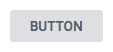
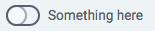
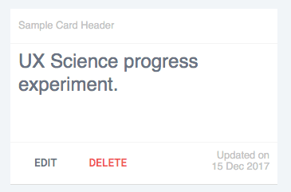
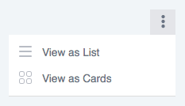
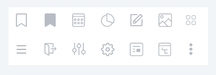
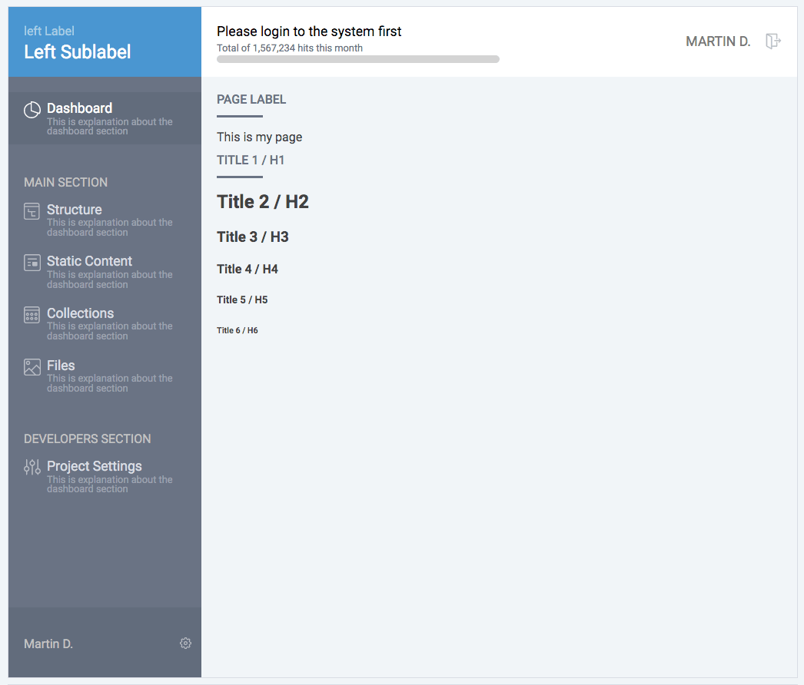
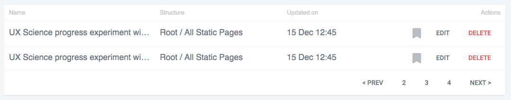
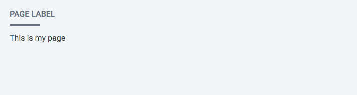
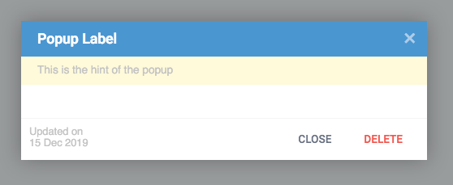
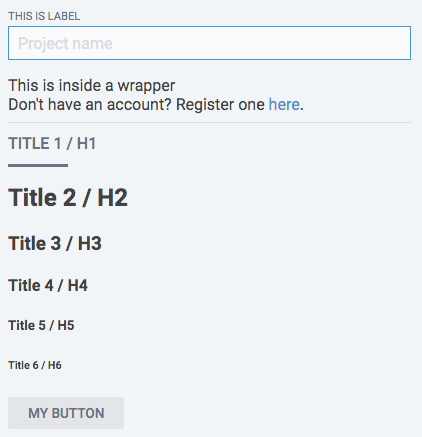

# smpladminui

> SimpleAdmin UI - React Components Library
>
> This is a set of simple UI components that can help you build simple Admin interface with a basic functionality.

[](https://www.npmjs.com/package/smpladminui) [](https://standardjs.com)

## Install

```bash
npm install --save-dev smpladminui
```

## Usage

```jsx
import React, { Component } from "react";

import { ButtonComponent as Button } from "smpladminui";

class Example extends Component {
  render() {
    return <Button />;
  }
}
```

You can import all the components into your application using the following lines:

```jsx
import React, { Component } from "react";

import {
  ButtonComponent as Button,
  LayoutComponent as Layout,
  PageComponent as Page,
  DropmenuComponent as Dropmenu,
  CardComponent as Card,
  ListComponent as List,
  PopupComponent as Popup,
  IconComponent as Icon,
  WrapperComponent as Wrapper
} from "smpladminui";

class Example extends Component {
  render() {
    return <Button />;
  }
}
```

Below you can see a list of all the components along with their props.

## Button

> This component is a simple styled button which can render in few different styles depending on the props and handling onClick event upon itself.


<br />

#### Usage

```jsx
import React, { Component } from "react";

import { ButtonComponent as Button } from "smpladminui";

class Example extends Component {
  render() {
    return <Button label={"No Action"} danger />;
  }
}
```

#### Props

| Prop name    | Type                       | Default  | Description                                                                                                                                   |
| ------------ | :------------------------- | :------- | --------------------------------------------------------------------------------------------------------------------------------------------- |
| `style`      | object                     | `{}`     | Style object to be passed to the rendered button                                                                                              |
| `label`      | string                     | "Button" | This is the label on the button. <br /><sub>_Note: in case there are children passed to this component, they will be rendered instead._</sub> |
| `disabled`   | boolean,function or string | none     | Renders the button as disabled                                                                                                                |
| `primary`    | boolean, any               | false    | Renders the button as primary                                                                                                                 |
| `danger`     | boolean, any               | false    | Renders the button as danger                                                                                                                  |
| `processing` | boolean, any               | false    | Renders the button as processing (with a spinning icon)                                                                                       |
| `onClick`    | function                   | none     | Handler for the onClick event of the button                                                                                                   |

<br />

---

## Toggle

> This component is a simple styled toggle which can render a toggle knob in few different styles depending on the props and handling onToggle event upon itself.


<br />

#### Usage

```jsx
import React, { Component } from "react";

import { ToggleComponent as Toggle } from "smpladminui";

class Example extends Component {
  render() {
    return <Toggle label={"No Action"} danger value={this.state.toggleValue} onToggle={(value) => this.setState({toggleValue})}/>;
  }
}
```

#### Props

| Prop name    | Type                       | Default  | Description                                                                                                                                   |
| ------------ | :------------------------- | :------- | --------------------------------------------------------------------------------------------------------------------------------------------- |
| `style`      | object                     | `{}`     | Style object to be passed to the rendered button                                                                                              |
| `label`      | string                     | Empty | This is the label on the toggle. <br /><sub>_Note: in case there are children passed to this component, they will be rendered instead._</sub> |
| `disabled`   | boolean,function or string | none     | Renders the button as disabled                                                                                                                |
| `primary`    | boolean, any               | false    | Renders the button as primary                                                                                                                 |
| `danger`     | boolean, any               | false    | Renders the button as danger                                                                                                                  |
| `processing` | boolean, any               | false    | Renders the button as processing (with a spinning icon)                                                                                       |
| `onToggle`    | function                   | none     | Handler for the onToggle event of the component. Returns the value of the toggle (true/false)                                                                                                   |

<br />

---

## Card

> This component is a simple styled card with header, body and footer. It can be rendered in different variations depending on the props passed to it.


<br />

#### Usage

```jsx
import React, { Component } from "react";

import { CardComponent as Card } from "smpladminui";

class Example extends Component {
  render() {
    return (
      <Card>
        <h1>UX Science progress experiment.</h1>
      </Card>
    );
  }
}
```

#### Props

| Prop name    | Type                       | Default                                               | Description                                                                                                                                                                                                                                                                                                                                                                          |
| ------------ | -------------------------- | ----------------------------------------------------- | ------------------------------------------------------------------------------------------------------------------------------------------------------------------------------------------------------------------------------------------------------------------------------------------------------------------------------------------------------------------------------------ |
| `style`      | object                     | `{}`                                                  | The style object that will be passed to the rendered card                                                                                                                                                                                                                                                                                                                            |
| `type`       | string                     | "children"                                            | Sets the style of the card. Options are: <ul><li>`children` - renders the children inside the body</li><li>`file` - renders file type icon inside the body</li><li>`image` - renders an image inside the body</li></ul>                                                                                                                                                              |
| `fileType`   | string                     | "video_mp4"                                           | The filetype that will be used in case the `type` is set to `file`. All the options are: <ul><li>application_pdf</li><li>application_msword</li><li>application_zip</li><li>application_x_rar</li><li>application_vnd_ms_excel</li><li>audio_mpeg</li><li>application_vnd_ms_powerpoint</li><li>text_plain</li><li>video_mp4</li></ul><sub>Note: This list will grow with time</sub> |
| `imageUrl`   | string                     | ""                                                    | The URL of the image which should be rendered in case the `type` is set to `image`                                                                                                                                                                                                                                                                                                   |
| `disabled`   | boolean,function or string | none                                                  | Renders the button as disabled                                                                                                                                                                                                                                                                                                                                                       |
| `primary`    | boolean, any               | false                                                 | Renders the button as primary                                                                                                                                                                                                                                                                                                                                                        |
| `danger`     | boolean, any               | false                                                 | Renders the button as danger                                                                                                                                                                                                                                                                                                                                                         |
| `processing` | boolean, any               | false                                                 | Renders the button as processing (with a spinning icon)                                                                                                                                                                                                                                                                                                                              |
| `header`     | boolean, string, object    | `<React.Fragment>Sample Card Header</React.Fragment>` | The contents of the header element of the card                                                                                                                                                                                                                                                                                                                                       |
| `footer`     | boolean, string, object    | \*several buttons and a text                          | The contents of the footer element of the card                                                                                                                                                                                                                                                                                                                                       |

<br />

---

## Dropmenu

> This component is a three dots icon which shows a list of options upon hover.


<br />

#### Usage

```jsx
import React, { Component } from "react";

import { DropmenuComponent as Dropmenu } from "smpladminui";

class Example extends Component {
  render() {
    return <Dropmenu style={{ float: "right" }} />;
  }
}
```

#### Props

| Prop name    | Type                       | Default                 | Description                                                                                                                                                                                                                                                 |
| ------------ | -------------------------- | ----------------------- | ----------------------------------------------------------------------------------------------------------------------------------------------------------------------------------------------------------------------------------------------------------- |
| `style`      | object                     | `{}`                    | The style object that will be passed to the rendered element                                                                                                                                                                                                |
| `disabled`   | boolean,function or string | none                    | Renders the button as disabled                                                                                                                                                                                                                              |
| `primary`    | boolean, any               | false                   | Renders the button as primary                                                                                                                                                                                                                               |
| `danger`     | boolean, any               | false                   | Renders the button as danger                                                                                                                                                                                                                                |
| `processing` | boolean, any               | false                   | Renders the button as processing (with a spinning icon)                                                                                                                                                                                                     |
| `options`    | array of objects           | `[{option1},{option2}]` | A list of options for the menu. Each object must have the following properties: <ul><li>`icon` - the Icon component for the option</li><li>`label` - the text for the option</li><li>`onClick` - event handler for the click event of that option</li></ul> |

<br />

---

## Icon

> This component is a three dots icon which shows a list of options upon hover.


<br />

#### Usage

```jsx
import React, { Component } from "react";

import { IconComponent as Icon } from "smpladminui";

class Example extends Component {
  render() {
    return <Icon type={"listtype_list"} variant={"grey"} />;
  }
}
```

#### Props

| Prop name    | Type                       | Default    | Description                                                                                                                                                                                                                                                                                                         |
| ------------ | -------------------------- | ---------- | ------------------------------------------------------------------------------------------------------------------------------------------------------------------------------------------------------------------------------------------------------------------------------------------------------------------- |
| `style`      | object                     | `{}`       | The style object that will be passed to the rendered element                                                                                                                                                                                                                                                        |
| `disabled`   | boolean,function or string | none       | Renders the icon as disabled                                                                                                                                                                                                                                                                                        |
| `primary`    | boolean, any               | false      | Renders the icon as primary<br><sub>_(not yet implemented)_</sub>                                                                                                                                                                                                                                                   |
| `danger`     | boolean, any               | false      | Renders the button as danger <br><sub>_(not yet implemented)_</sub>                                                                                                                                                                                                                                                 |
| `processing` | boolean, any               | false      | Renders the button as processing (with a spinning icon) <br><sub>_(not yet implemented)_</sub>                                                                                                                                                                                                                      |
| `type`       | string                     | "settings" | Sets the type of the icon. Options are: <ul><li>bookmark_off</li><li>bookmark_on</li><li>collections</li><li>dashboard</li><li>edit</li><li>files</li><li>listtype_cards</li><li>listtype_list</li><li>logout</li><li>projectsettings</li><li>settings</li><li>static</li><li>structure</li><li>threedots</li></ul> |
| `variant`    | string                     | "grey"     | Sets the color of the icon. Options are: <ul><li>grey</li><li>white</li></ul>                                                                                                                                                                                                                                       |
| `onClick`    | function                   | none       | Handler for the onClick event of the icon                                                                                                                                                                                                                                                                           |

<br />

---

## Layout

> This component is layout component useful for building the main interface of the admin system. It has sidebar with options, header with labels and footer.


<br />

#### Usage

```jsx
import React, { Component } from "react";

import { LayoutComponent as Layout } from "smpladminui";

class Example extends Component {
  render() {
    return (
      <Layout progress={0}>
        <Page>
          <Wrapper>
            This is my page
            <h1>Title 1 / H1</h1>
            <h2>Title 2 / H2</h2>
            <h3>Title 3 / H3</h3>
            <h4>Title 4 / H4</h4>
            <h5>Title 5 / H5</h5>
            <h6>Title 6 / H6</h6>
          </Wrapper>
        </Page>
      </Layout>
    );
  }
}
```

#### Props

| Prop name         | Type             | Default                                     | Description                                                                                                                                                                                                                                                                                                                                                                                                                                                            |
| ----------------- | ---------------- | ------------------------------------------- | ---------------------------------------------------------------------------------------------------------------------------------------------------------------------------------------------------------------------------------------------------------------------------------------------------------------------------------------------------------------------------------------------------------------------------------------------------------------------- |
| `leftLabel`       | string           | "left Label"                                | The smaller label on the top of the sidebar                                                                                                                                                                                                                                                                                                                                                                                                                            |
| `leftSublabel`    | string           | "Left Sublabel"                             | The bigger label on the top of the sidebar                                                                                                                                                                                                                                                                                                                                                                                                                             |
| `centerLabel`     | string           | "Please login to the system first"          | The label on the header of the layout                                                                                                                                                                                                                                                                                                                                                                                                                                  |
| `centerSublabel`  | string           | "Total of 1,567,234 hits this month"        | The sublevel on the header of the layout                                                                                                                                                                                                                                                                                                                                                                                                                               |
| `centerRightIcon` | Icon component   | `<Icon type={"logout"} variant={"grey"} />` | The Icon on the top right corner of the header                                                                                                                                                                                                                                                                                                                                                                                                                         |
| `centerRightText` | string           | "Martin D."                                 | The text displayed next to the top right icon on the header                                                                                                                                                                                                                                                                                                                                                                                                            |
| `progress`        | number           | null                                        | Sets the percentage of the progress bar in the header. Values could be 0 - 100. <br /><sub>Note: If this is set to `null` the progress bar will not be displayed</sub>                                                                                                                                                                                                                                                                                                 |
| `sidebarElements` | array of objects | some default options                        | An array of objects each of them with the following properties: <ul><li>`type` (string) - could be either "item" or "section" and will determine whether it's a section title or an item</li><li>`label` (string) - the label of the menu</li><li>`description` (string) - the sublabel/description of the menu</li><li>`icon` (Icon component) - the icon for the menu</li><li>`selected` (boolean) - shows whether the menu should be rendered as selected</li></ul> |

<sub>Note: Everything that is placed as children inside this component will be rendered inside the body of the layout.</sub>

<br />

---

## List

> This component is a list having header, list of elements and footer. It is useful to represent data in a list format.


<br />

#### Usage

```jsx
import React, { Component } from "react";

import { ListComponent as List } from "smpladminui";

class Example extends Component {
  render() {
    return <List />;
  }
}
```

#### Props

| Prop name | Type             | Default                                                                                                                                                                                                                                                                                                                                                                                               | Description                                                                                                                                                |
| --------- | ---------------- | ----------------------------------------------------------------------------------------------------------------------------------------------------------------------------------------------------------------------------------------------------------------------------------------------------------------------------------------------------------------------------------------------------- | ---------------------------------------------------------------------------------------------------------------------------------------------------------- |
| `style`   | object           | `{}`                                                                                                                                                                                                                                                                                                                                                                                                  | The style object that will be passed to the rendered element                                                                                               |
| `header`  | array of strings | ["Name", "Structure", "Updated on", "Actions"]                                                                                                                                                                                                                                                                                                                                                        | Sets the header elements (column names) of the list                                                                                                        |
| `footer`  | object           | `React.Fragment` with several buttons inside                                                                                                                                                                                                                                                                                                                                                          | Sets the footer of the list. Could be any element you decide.                                                                                              |
| `list`    | array of arrays  | <code>[ "UX Science progress experiment with a very very long name that goes on one line for a long line", "Root / All Static Pages", "15 Dec 12:45", <br><React.Fragment><br><Button danger style={{ float: "right" }}>delete</Button><br><Button style={{ float: "right" }}>edit</Button><br><Icon type={"bookmark_on"} variant={"grey"} style={{ float: "right" }} /><br></React.Fragment>]</code> | Each element of this array should be an array with the same number of elements like the header elements. Each element will be placed in the proper column. |

<br />

---

## Page

> This component is a simple wrapper representing a page in our layout. It has a label and content (children).


<br />

#### Usage

```jsx
import React, { Component } from "react";

import { PageComponent as Page } from "smpladminui";

class Example extends Component {
  render() {
    return <Page label={"Page label"}>This is my page</Page>;
  }
}
```

#### Props

| Prop name      | Type    | Default      | Description                                                    |
| -------------- | ------- | ------------ | -------------------------------------------------------------- |
| `style`        | object  | `{}`         | The style object that will be passed to the rendered element   |
| `label`        | string  | "Page Label" | The label of the page displayed at the top                     |
| `stickyHeader` | boolean | false        | Whether the label should stay sticky to the top when scrolling |

<br />

---

## Popup

> This component is a popup element with header (with close button), hint line, body and footer. <br />Often used when there is a need to enter data or display a message to the user.


<br />

#### Usage

```jsx
import React, { Component } from "react";

import { PopupComponent as Popup } from "smpladminui";

class Example extends Component {
  render() {
    return (
      <Popup
        visible={this.state.popupVisible}
        onClose={this.togglePopupVisible}
        footer={
          <React.Fragment>
            <div style={{ width: "100%", textAlign: "left" }}>
              <Button style={{ float: "right" }} danger>
                delete
              </Button>
              <Button
                style={{ float: "right" }}
                onClick={this.togglePopupVisible}
              >
                close
              </Button>
              Updated on
              <br />
              15 Dec 2017
            </div>
          </React.Fragment>
        }
        hint={"This is the hint of the popup"}
      >
        Body of the popup
      </Popup>
    );
  }
}
```

#### Props

| Prop name | Type     | Default                                      | Description                                                                                                                                                                          |
| --------- | -------- | -------------------------------------------- | ------------------------------------------------------------------------------------------------------------------------------------------------------------------------------------ |
| `style`   | object   | `{}`                                         | The style object that will be passed to the rendered element                                                                                                                         |
| `label`   | string   | "Popup Label"                                | The label of the popup displayed at the top. <br /><sub>Note: You can use any element here like placing an icon before the label.</sub>                                              |
| `hint`    | string   | null                                         | Any text that you want to be displayed as a hint on top of the popup. If the value is `null` the hint will not be displayed                                                          |
| `type`    | string   | "normal"                                     | Sets the style of the popup. Options are: <ul><li>`normal` - normal popup</li><li>`message` - displays the body of the popup bigger in size. Useful in displaying messages</li></ul> |
| `time`    | number   | 0                                            | If set (in seconds) will autoclose the popup in the set number of seconds                                                                                                            |
| `footer`  | object   | `React.Fragment` with two buttons and a text | Sets the footer element of the popup. If set to `null` it will not be displayed                                                                                                      |
| `onClose` | function | none                                         | Event handler for the close function of the popup                                                                                                                                    |

<br />

---

## Wrapper

> This component is a simple wrapper component apllying some default styles to the elements inside it like labels, text boxes, titles, buttons etc.


<br />

#### Usage

```jsx
import React, { Component } from "react";

import { WrapperComponent as Wrapper } from "smpladminui";

class Example extends Component {
  render() {
    return (
      <Wrapper>
        <label>
          This is label
          <input type="text" placeholder="Project name" />
        </label>
        This is inside a wrapper
        <br />
        Don't have an account? Register one <a href="register.html">here</a>
        .
        <hr size="1" noshade="noshade" />
        <h1>Title 1 / H1</h1>
        <h2>Title 2 / H2</h2>
        <h3>Title 3 / H3</h3>
        <h4>Title 4 / H4</h4>
        <h5>Title 5 / H5</h5>
        <h6>Title 6 / H6</h6>
        <button>My Button</button>
      </Wrapper>
    );
  }
}
```

#### Props

| Prop name | Type   | Default | Description                                                  |
| --------- | ------ | ------- | ------------------------------------------------------------ |
| `style`   | object | `{}`    | The style object that will be passed to the rendered element |

### Thoughts

This is work in progress and we will continue working on this simple collection of elements.
If you want to participate in it, please do not hesitate to get involved.

## License

MIT © [marDonchev](https://github.com/marDonchev)
